# Hardware

### Connect DHT22 Sensor

- **VCC pin (+):** Connect to the 3V3 pin on the ESP32.  
- **DATA pin (OUT):** Connect to GPIO 4 on the ESP32.  
- **GND pin (-):** Connect to GND on the ESP32.  

### Connect On/Off LED

- GPIO 2 on many ESP32 boards is already connected to a built-in blue LED.  
- The **anode (+)** of the LED (long leg) connects to GPIO 2 on the ESP32.  
- The **cathode (-)** of the LED (short leg) connects to GND on the ESP32.  

### Connect PWM LED

- The **anode (+)** of the LED (long leg) connects to GPIO 25 on the ESP32.  
- The **cathode (-)** of the LED (short leg) connects to GND on the ESP32.  

---

# If Using Arduino IDE

1. Press **Ctrl + N** to create a new file.  
2. Open **Library Manager** and install the required libraries:  
   - DHT sensor library  
   - Firebase ESP32  
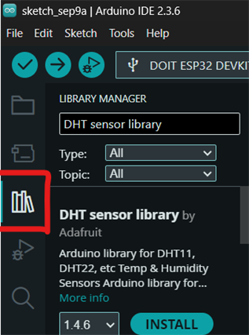
3. Open **Boards Manager** and install *Arduino ESP32 Boards* (or esp32 depending on your board).  
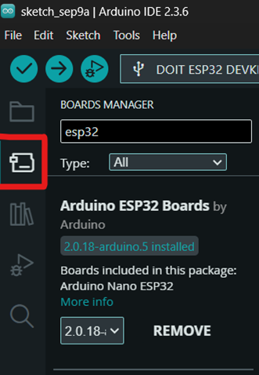
4. Go to **Tools → Board** and select the correct ESP32 board.  
   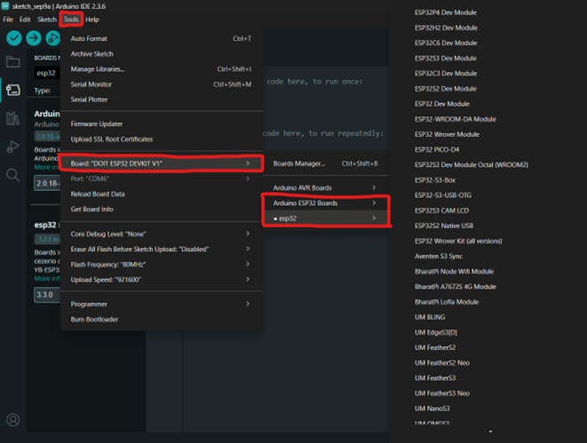
5. Copy and paste the code.  
6. Select the correct Port for your ESP32.  
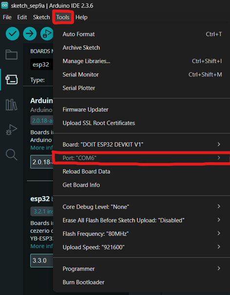
7. **Verify** and **Upload** the code to the ESP32.  
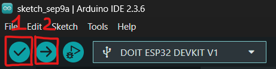
---

# If Using VS Code (PlatformIO)

1. Open **Extensions** (Ctrl + Shift + X), install **PlatformIO IDE**.  
   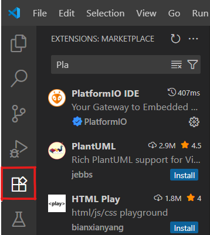
2. After installation, open PlatformIO and create a new project.  
   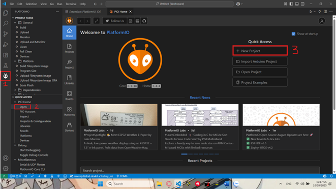
3. Set project name, select the correct board, and choose a path (optional).  
    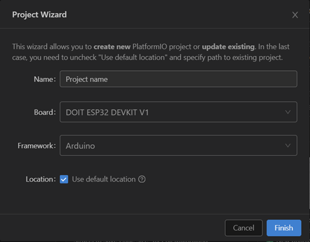
4. After creating, open **platformio.ini** and add the following libraries (don’t forget to save):  
```ini
lib_deps =
    adafruit/Adafruit Unified Sensor@^1.1.15
    adafruit/DHT sensor library@^1.4.6
    mobizt/Firebase ESP32 Client@^4.4.17
```
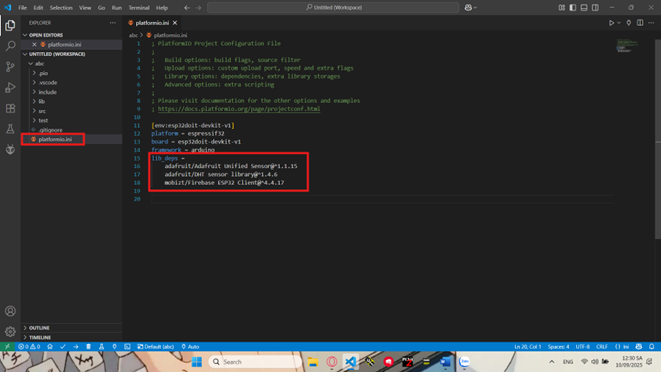
5. Open **main.cpp** inside the `src` folder and paste your code:
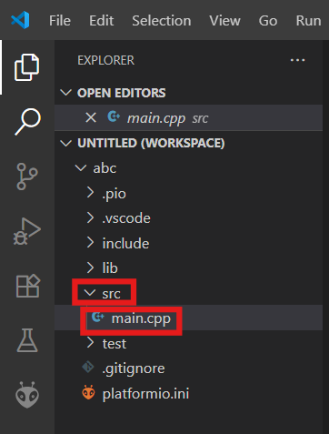
6. Select the correct port connected to the ESP32.  
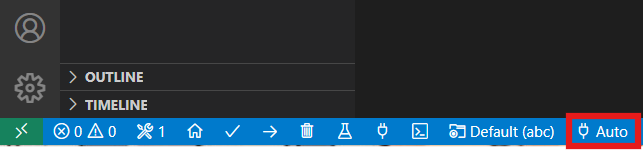
7. **Build** and **Upload** code to ESP32.  
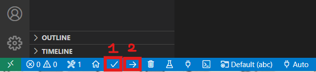
8. After uploading, open **Serial Monitor** to observe.  
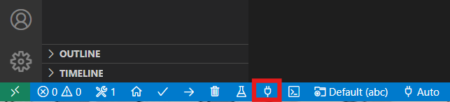
