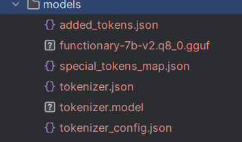

# Smart Home Virtual Assistant
 A function calling llm for smarthome by function calling


## Running llama model server
```bash
python -m llama_cpp.server --model .\models\functionary-7b-v2.q8_0.gguf --chat_format functionary-v2 --hf_pretrained_model_name_or_path ./models
```

## Wake word detection
This is for the model to only activate the whole thing when being called. This is actually an Audio Classification task.

I proposed 2 ways to handle this task, either using pretrained model on Hugging Face or just find the dataset and make your self a RNN model.

1. Using pretrained

This approach is extremely simple, only drawback is you hardly get to decide what the wake word might be.

But it can make up for the difficulty of dataset finding step.


2. Building an RNN


## Speech-to-Text


## Large Language Model
1. Using models on Hugging Face

Model path: <a url="https://huggingface.co/meetkai/functionary-7b-v2-GGUF/tree/main">Link</a>

You will need to download all the followings and save them in models:


For the model, you can change between q4 (4bits), q8 or q16 for examining different performances.

2. Using DeepSeek R3 Function Calling API

3. Using Ollama


